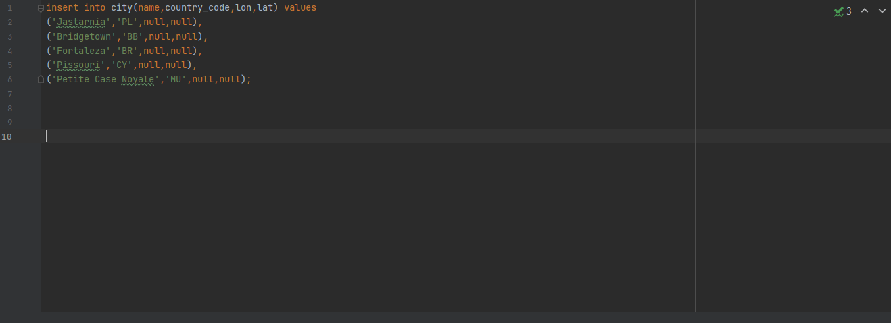
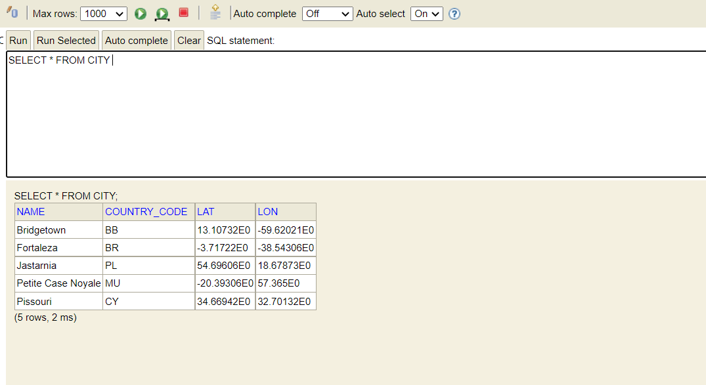
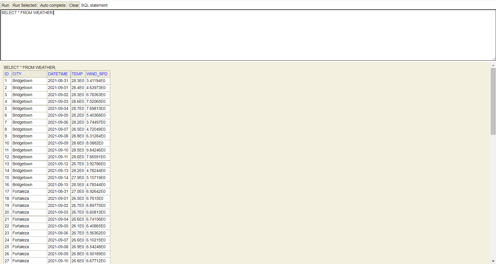
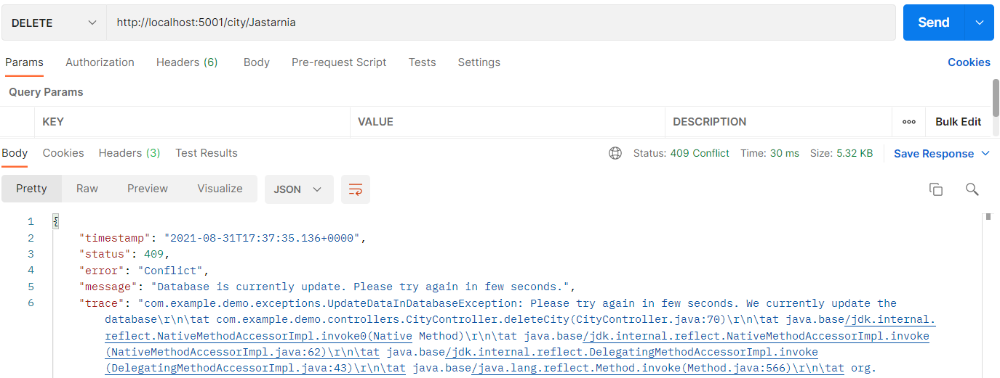
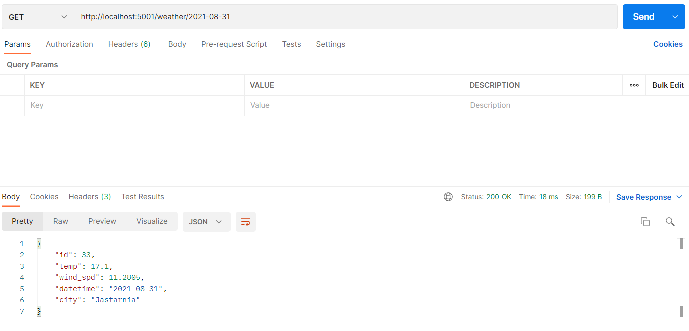

# Surfer application

The project presents an application to find the best location for surfers. The application finds the most optimal surfing conditions from a collection of given places. 
Technology stack:
- Spring Boot
- H2 database
- JUnit
- Maven 

How to run application:
```
mvn spring-boot:run
```

The main problem that had to be solved in the task was the method of storing application parameters, which was partially provided by the free API from the website:

https://www.weatherbit.io/api/weather-forecast-16-day

The application was to be functional and ready for possible expansion. After an initial analysis of the available options, I decided to use the H2 database. The database solution is good because it helps to store the parameters provided by the API. The only problem that had to be solved at that time was how to refresh the data in the database so that it was up-to-date with the API. At the moment of starting the application downloads data from the data.sql file and saves them in the database.

The data.sql file is shown below:



When the data is saved to the database, two cyclical functions are activated. These functions are called Task Schedulers. The first one is responsible for catching new records that have appeared in the database. Its refresh rate is 6 seconds. When the first 5 records appear in the database with empty parameters, the method catches them and then asks the API for parameters for a given city. These parameters are: latitude and longitude as well as a long-term forecast for a given locality. The parameters for the weather are primarily: average air temperature, wind speed, day and city name. After obtaining the parameters from the API, the application completes the records in the database and saves them to the database. This is shown in the pictures below:





The second cyclic method ensures that the data is refreshed on a regular basis. It queries the API once every 30 minutes and refreshes all records in the Weather database. The application is additionally equipped with the possibility of automatically adding records to the City table. It is enough to add a new town to the CITY table by means of an appropriate query (POST). The cyclical method will ask the API and then complete the city and weather in the CITY and WEATHER table. We can also remove any city from the CITY table at any time. The recursive method will also clear records from the WEATHER table for that city. The application has also been secured in the event of a sudden addition or deletion of a record in the database when cyclical methods update the data:



The most important functionality, however, is the algorithm to detect the best weather for surfers. The weather should be in the range:
- 5 to 35 degrees for temperature
- 5 to 18 for wind speed

If the city meets the requirements, the coefficient is calculated from the formula:
- wind * 3 + avg_temperature
The city with the highest ratio wins.

The result for the 5 basic settlements that were imposed at the beginning of the task for 2021-08-31 is as follows:



I have put the list of available endpoints on the website:
```
http://localhost:5001/swagger-ui.html#/
```

However, you should run the applications first.

## List of curl for CITY table:

**Get all city in database**
```
curl -X GET "http://localhost:5001/city/" -H "accept: */*"
```
**Add new city to database**
```
curl -X POST "http://localhost:5001/city/addNewCity/Szczecin/PL" -H "accept: */*" -H "Content-Type: application/json" 
```
**Delete city from CITY table (and all related records in WEATHER table)**
```
curl -X DELETE "http://localhost:5001/city/Jastarnia" -H "accept: */*" -H "Content-Type: application/json" 
```

## List of curl for WEATHER table:

**Get all weather in database**
```
curl -X GET "http://localhost:5001/weather/" -H "accept: */*"
```

**Get city records weather in database**
```
curl -X GET "http://localhost:5001/weather/data/Bridgetown/BB" -H "accept: */*"
```
## Main curl (required for the task):
```
curl -X GET "http://localhost:5001/weather/2021-08-31" -H "accept: */*"
```

Remarks:
- Application tests are available in the class\src\test\java\com\example\demo\test\WeatherTest.java
- Le Morne (Mauritius) has been changed in API to Petite Case Noyale (same coordinates on internet) :)
